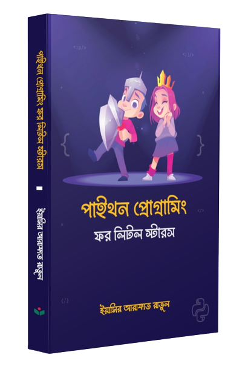

**Python Programming For Little Stars**
*~Yeasir Arafat Ratul*
*Publisher - Odommo Prokash*
 

**CHAPTERS**

1. প্রোগ্রামিং পরিচিতি
2. চলো অজগরকে বাসায় আনি
3. পাইথনের অ আ ক খ
4. পাইথন অপারেটরস
5. ডেটা টাইপ
6. ডেটা স্ট্রাকচার
7. কন্ডিশন
8. লুপ
9. ফাংশন
10. ক্লাস 
11. ওয়ার্ড গেম Guess The Word